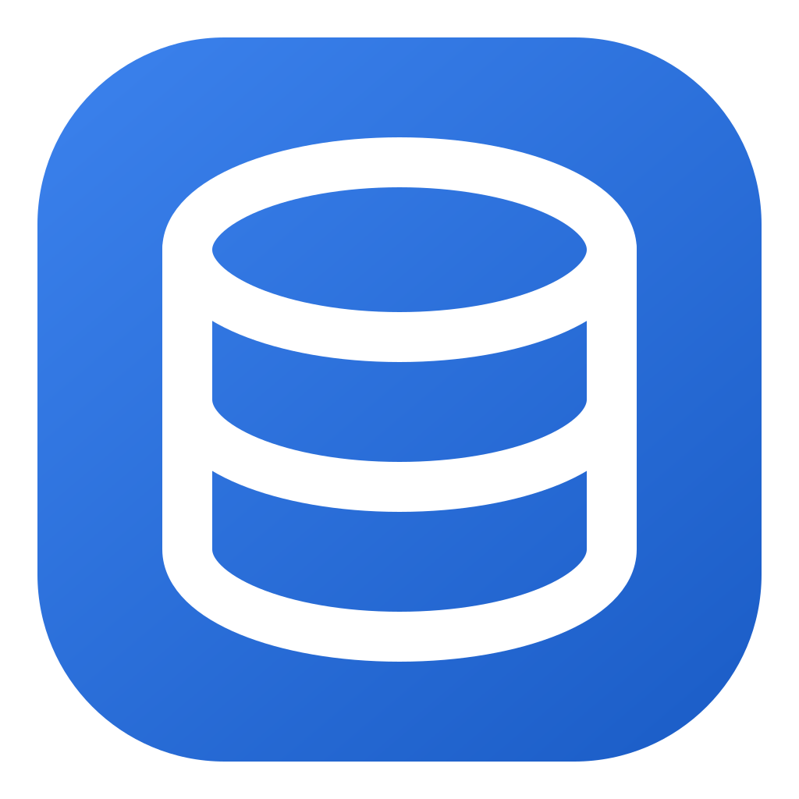
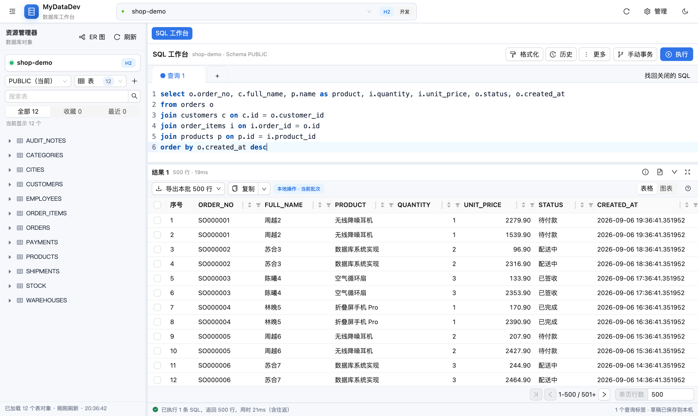
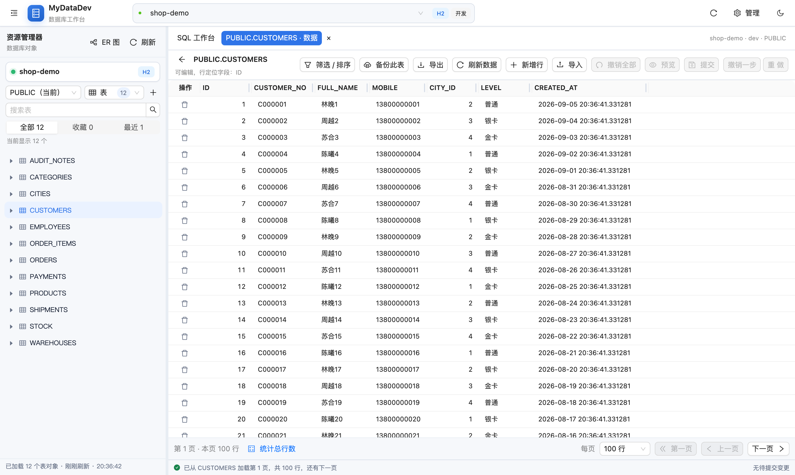
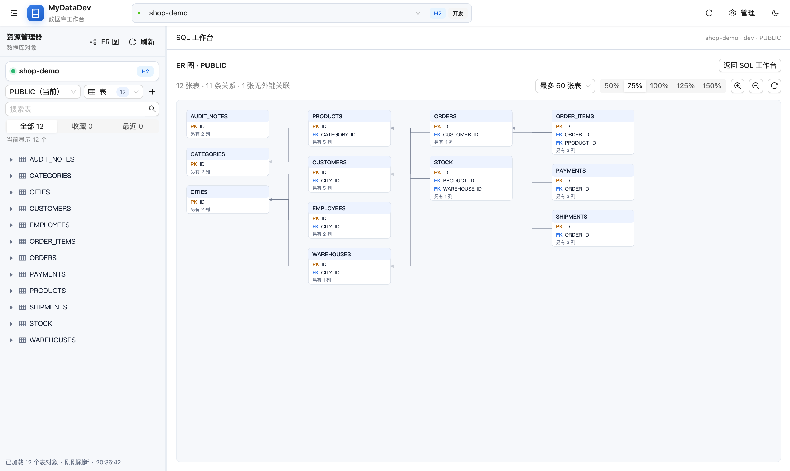
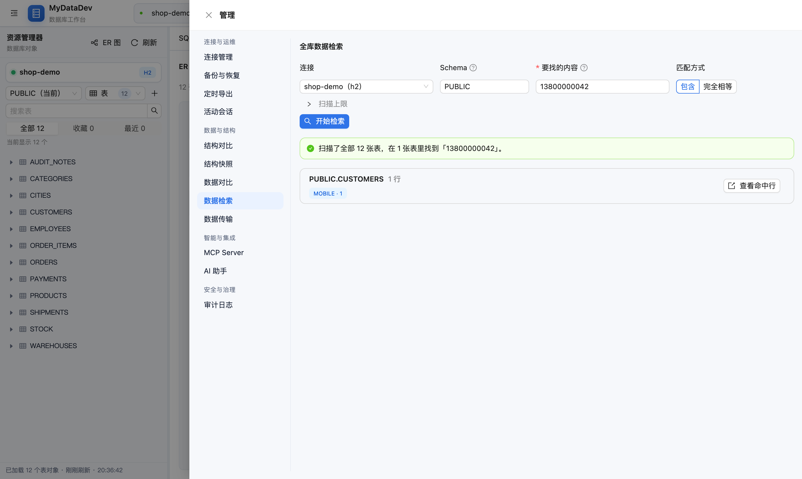
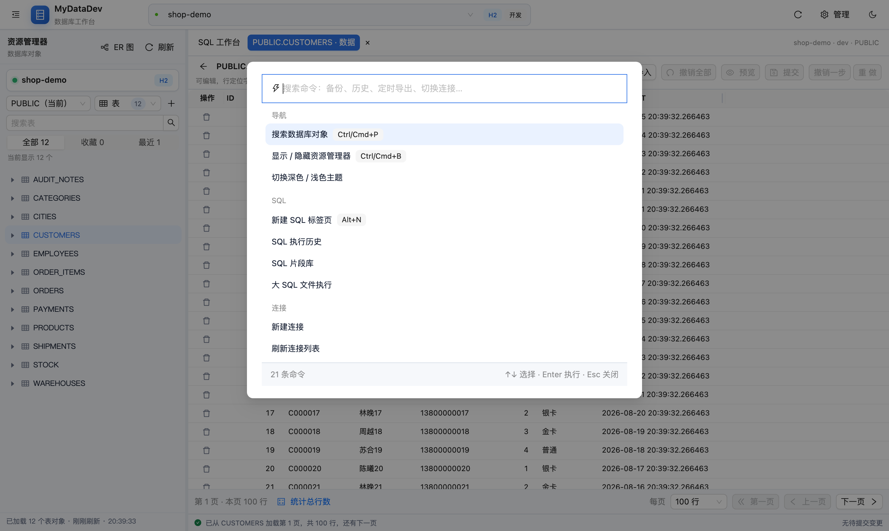
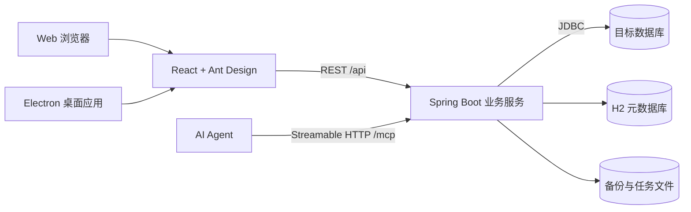

<div align="center">
  

  <h1>MyDataDev</h1>

  <p>
    <b>面向本机与私有网络的现代数据库工作台</b><br />
    浏览、SQL 开发、数据维护、对象管理、备份恢复与 AI 查询接入，都在一套界面里
  </p>

  <p>
    <a href="https://github.com/tanner-sh/MyDataDev/releases/latest"></a>
    
    
  </p>

  <p>
    
    
    
    
    
  </p>

  <p>
    <a href="https://github.com/tanner-sh/MyDataDev/releases/latest"><b>下载发行包</b></a>
    ·
    <a href="#快速开始">快速开始</a>
    ·
    <a href="#核心能力">核心能力</a>
    ·
    <a href="#界面一览">界面一览</a>
    ·
    <a href="#文档">文档</a>
  </p>

  <br />

  

</div>

---

## 项目简介

MyDataDev 是一款接近桌面数据库 IDE 使用体验的 Web 数据库管理工具，同时提供开箱即用的 Electron 桌面版。所有目标数据库访问统一由 Spring Boot 后端通过 JDBC 完成，前端专注于连接管理、资源浏览、SQL 工作台、表格编辑和运维任务。

项目适合个人开发环境、内部研发网络和受控运维场景。它不是面向公网的托管数据库服务；Web 模式应部署在可信网络中，并配合反向代理和组织现有的身份认证体系使用。

几条贯穿全局的取舍：

- **危险操作要过闸门。** 只读连接在后端拒绝一切写入；生产连接上的自由 SQL 与写操作要求回传连接名确认；不含顶层 `WHERE` 的 `UPDATE`/`DELETE` 需要单独确认。应用层保护不替代数据库权限，但它挡住的是手滑。
- **AI 拿得到什么由你逐条授权。** 连接默认「不参与 AI」，「仅结构」档不发任何行数据，AI 也没有执行权限 —— 它的产出只落到编辑器标签页。
- **一套后端，两种形态。** 桌面版与 Web 版跑的是同一个 Spring Boot 服务；桌面版不需要另外装 Java，Web 版是一个自带前端的可执行 JAR。
- **目标数据永远在远端。** 本地 H2 只存连接配置、SQL 历史、审计与任务状态。

## 界面一览

<table>
  <tr>
    <td width="50%"></td>
    <td width="50%"></td>
  </tr>
  <tr>
    <td align="center"><sub><b>表数据</b> —— 服务端筛选与排序、游标分页，改动先进待提交区，提交前可预览 SQL</sub></td>
    <td align="center"><sub><b>ER 图</b> —— 按外键自动分层，被引用的字典表在左；自绘 SVG，不引图表库</sub></td>
  </tr>
  <tr>
    <td width="50%"></td>
    <td width="50%"></td>
  </tr>
  <tr>
    <td align="center"><sub><b>全库数据检索</b> —— 「这个手机号还留在哪张表」；扫描触到上限会明说，不会把半程结果报告成全部</sub></td>
    <td align="center"><sub><b>命令面板</b> —— <kbd>Ctrl/Cmd</kbd>+<kbd>K</kbd> 搜索应用能做的事，同时充当快捷键说明书</sub></td>
  </tr>
</table>

## 核心能力

### SQL 开发

| 能力 | 说明 |
| --- | --- |
| **SQL 工作台** | CodeMirror 多标签编辑器、SQL 格式化、按库元数据的智能补全、定义跳转、多语句执行、分页结果、执行计划、任务取消与 SQL 历史。编辑器还会给库里不存在的表名画波浪线 —— 只在对象清单确实完整时提示，宁可不提示也不误报。 |
| **草稿与工作恢复** | SQL 按账号与连接保存在本机，刷新后恢复并可找回最近关闭的标签；页面内重新登录后继续编辑。 |
| **手动事务** | 把一个标签页里的多次执行绑到同一条连接与事务上，先看效果再决定提交或回滚；空闲超时自动回滚，避免忘记提交把连接池占死。 |
| **SQL 片段库** | 保存常用语句并按标签检索，记录使用次数与最近使用时间。 |
| **SQL 历史与统计** | 按连接、关键字与时间检索执行历史；另有最慢、失败最多与「谁在跑」三个统计视角，用来找该优化哪条语句，而不是逐条翻。 |
| **全局搜索** | `Ctrl/Cmd+P` 跨表、视图、序列、存储过程等对象类型搜索并直达。 |
| **命令面板** | `Ctrl/Cmd+K` 搜索应用能做的事：管理抽屉的每个分区、SQL 工具条上的动作、切换连接。不可用的命令也会列出并说明原因，同时充当快捷键说明书。 |
| **结果图表** | 查询结果可切换为柱状图、折线图或饼图，自动识别数值列；色板经色觉障碍校验，量级悬殊时提示拆开查看而不是叠加第二个坐标轴。 |
| **导入与导出** | 导入 CSV、Excel（.xlsx）、JSON 与 SQL：小文件直接落成待提交记录可逐行核对，大文件与 Excel 转为带进度、可取消的后台任务；主键冲突可选直接插入（默认，撞了整批失败）、跳过重复行或更新已存在的行。查询结果可导出为 CSV、JSON、SQL、XML、Markdown 表格或 Excel。 |

### 数据与结构

| 能力 | 说明 |
| --- | --- |
| **数据浏览与维护** | 游标分页浏览表数据，支持服务端多条件筛选和多字段排序；新增、编辑和删除行，提交前预览 SQL，对无稳定行标识和危险更新进行保护。 |
| **编辑与多对象标签** | 表数据支持撤销/重做、类型校验、长文本与 JSON 编辑、并发冲突处理；切换表与结构标签保留当前页面内的修改、筛选和设计稿。 |
| **表与数据库对象** | 查看字段、主键、索引、外键、行数和 DDL；按方言管理表、视图、物化视图、序列、触发器、存储过程和函数。列注释可以直接在表设计器里改（SQLite 与 SQL Server 不支持，界面上不显示这一列）。 |
| **存储过程与函数** | 参数化调用（IN/OUT/INOUT、返回值、多结果集），并补上两件容易被漏掉的事：Oracle 上语法错误也会「创建成功」，所以创建后回查数据字典报出编译错误、编辑器不关闭；例程自己打印的输出（PostgreSQL `RAISE NOTICE`、MySQL 警告、Oracle `DBMS_OUTPUT`）一并显示。 |
| **ER 图** | 按外键自动绘制当前 Schema 的实体关系图：表按依赖分层，被引用的字典表在左、引用它们的业务表在右；自绘 SVG，不引图表库。 |
| **结构对比与同步** | 选定两个连接/Schema 比较表、字段、索引与主键差异，生成把目标端对齐到源端的迁移 DDL，脚本送进 SQL 工作台后照常经过生产确认与审计。 |
| **结构快照与漂移** | 按 cron 或手动给一个 Schema 存结构快照，回答「这个字段是什么时候加的」。结构没变时只推进「最后一次见到」的时间、不新增记录，时间线上留下的因此都是真正变过的时刻；漂移判定与结构对比同一套逻辑。刻意不生成「改回去」的脚本 —— 快照是记录不是期望状态。 |
| **数据对比与同步** | 两张表逐行比对，按主键哈希匹配（不做归并，两侧排序规则不同不会把相同的行报成差异），列出只在一侧、以及主键相同但字段不同的行，并按目标端方言生成同步脚本；默认不生成 DELETE。二进制与大对象列不参与对比，跳过了哪些会写进提示。 |
| **全库数据检索** | 在一个 Schema 的所有表里找一个值 —— 「这个手机号还留在哪张表」。比较语义与结果表格的筛选完全同源，每张命中表回传一条可直接执行的查询。表数、每表取样行数与总时间预算三条上限任何一条触顶，都会明确报告「扫到一半停了」，而不是让人把它读成「全库只有这些」。 |
| **跨连接数据传输** | 把 A 库的一张表或一段查询结果搬到 B 库的表里，不经 CSV 中转（空串与 NULL 因此分得清）。读侧沿用导出的规矩，写侧沿用后台 SQL 任务，进度、取消、并发闸门、生产确认与两端审计都不另起一套。 |

### 连接与运维

| 能力 | 说明 |
| --- | --- |
| **多数据库连接** | 新增、编辑、复制、删除和测试连接；区分开发、测试、生产环境，支持只读连接、分组标签与加密保存密码。 |
| **SSH 隧道** | 目标库只对跳板机开放时，由后端建立本地端口转发再连库；支持口令与私钥认证、主机指纹校验，元数据、备份、MCP 等功能无需感知。 |
| **备份与恢复** | SQL 逻辑备份、定时任务、保留策略、历史与校验值；支持 MySQL/MariaDB、PostgreSQL 和 Oracle 原生工具、SMB/NFS/FTP/SFTP 文件服务以及后台恢复任务。历史里可以对一份备份执行「校验」：完整读一遍并比对大小与 SHA-256，回答「文件还在吗、内容有没有变、远端还取得回来吗」—— 这是文件级校验，不是恢复演练。 |
| **定时导出** | 按 cron 或手动提交后台查询导出，支持取消、运行历史与文件下载；按任务隔离产物并自动清理旧文件。只接受单条查询，生产连接需要在创建任务时输入连接名确认。 |
| **大 SQL 文件执行** | 上传并在后台执行 SQL 文件，跟踪语句进度、结果统计和失败位置，支持取消与异常任务恢复。 |
| **活动会话与阻塞分析** | 查看目标库上的活动会话并终止指定会话；再往前一步给出「谁在等谁」：把直接阻塞关系连成链，每个节点标出下游被堵的会话总数，根节点那个数就是「终止它能放开几个会话」，互相等待的环单独报出来。阻塞关系读不到（缺权限或版本没有那张视图）不影响会话列表照常显示。 |
| **后台任务进度** | 备份、恢复、大文件执行与定时导出的进度通过 SSE 推送，关闭抽屉后不会与任务失联。 |
| **连接池可见性** | 名额被哪条连接占着、哪个池早就闲了，直接摆在连接管理里，而不是等到报出「连接池已达上限」再去别处找。 |
| **配置导出与导入** | 把连接（含 SSH 隧道）打成一个用口令加密的归档文件，在另一台装机上导入 —— 桌面版与 Web 版的加密密钥不同，归档因此不搬密文而是用口令重新加密。仅管理员可用，两端都写审计。 |

### 安全与治理

| 能力 | 说明 |
| --- | --- |
| **Web 多用户与 SSO** | 内置账号体系、管理员/操作员角色、服务端会话与 CSRF 防护；支持通用 OIDC 单点登录，用户名、显示名、角色与用户组由身份提供器同步。 |
| **连接级权限** | 按用户或用户组授予元数据查看、查询、数据写入、DDL、导出、备份恢复与连接管理七类权限。 |
| **审计与告警** | 登录、拒绝访问、数据浏览、导出与下载均记录请求来源、User-Agent 与请求 ID，并按连接归属可筛；记录串联 SHA-256 哈希链，可检测删除、插入、字段修改与顺序篡改。高风险事件可经带 HMAC 签名的 Webhook 外发。 |
| **写操作闸门** | 只读连接在后端拒绝一切写入与结构变更；生产连接上的自由 SQL 与写操作要求回传连接名确认；不含顶层 WHERE 的 UPDATE/DELETE 需要单独确认。 |

### AI 接入

| 能力 | 说明 |
| --- | --- |
| **MCP Server** | 通过 Agent API Key 与连接白名单，为 AI 客户端提供元数据浏览、表数据浏览、查询和执行计划。访问档位**按连接**授予（只读 / 数据读写 / 完全），默认只读；写操作与界面共用同一条执行路径，只读连接、生产确认、未限定范围写确认与审计一个都不少。 |
| **AI 助手** | 工作台内置的模型能力，自然语言转 SQL 是一个服务端闭环的 Agent：按需搜索当前 Schema 的表/字段注释、读取字段与外键、参考这个库的历史查询口径，生成前先做一次编译校验；需求有歧义时它会直接反问而不是猜。执行报错诊断、执行计划解读（可给出一条 `CREATE INDEX` 建议）、结果复盘都并入同一段会话；此外还有查询结果解读与图表推荐、数据字典生成、结构同步脚本风险说明。**AI 没有执行权限**，产出只落到新编辑器标签页，执行仍走原有的权限、生产确认与审计。 |
| **业务词典与用量** | 「会员」「买家」这类只在人嘴里存在的说法，用词典补给模型；候选词条从表注释自动推出来供审阅，而「搜了一个词却什么都没搜到」的现场会被记下来，指出用户的说法和库里的命名在哪儿对不上。管理抽屉里可以看 token 用量并设日额度闸门，超额时在请求发出前就拦住。 |
| **AI 的数据边界** | 连接默认「不参与 AI」，由管理员逐条授权；「仅结构」档只发表名、列名、类型、索引与注释，不发任何行数据；样本档受行数上限约束且生产连接禁用。服务商可选官方 Claude API 或 OpenAI 兼容协议（自建网关、Ollama 等），离线环境可完全不启用。API Key 用系统托管主密钥加密存储，任何接口都读不回明文。 |

### 数据库支持

MyDataDev 内置以下数据库类型及对应 JDBC 驱动：

<p>
  
  
  
  
  
  
  
  
  
  
  
</p>

基础 SQL 执行和元数据浏览由 JDBC 提供；表编辑、执行计划、对象管理、备份与恢复等高级能力会根据数据库方言和驱动能力自动启用。原生备份或恢复还要求相应工具安装在运行后端的机器上。

---

## 快速开始

### 桌面版

从 [GitHub Releases](https://github.com/tanner-sh/MyDataDev/releases/latest) 下载当前平台的安装包：

| 平台 | 架构与安装包 |
| --- | --- |
| macOS | Apple Silicon / Intel，DMG |
| Windows | x64，Setup.exe |
| Linux | x64，DEB / RPM |

桌面版无需额外安装 Java，也无需分别启动前端和后端。应用会在本机启动内置服务，数据、备份和日志保存在操作系统应用数据目录中。当前 macOS 发行版未使用 Apple Developer ID 公证，首次打开方式见[桌面版开发与发行说明](docs/desktop.md#无-apple-开发者账号的发布策略)。

### Web 服务端

从 [GitHub Releases](https://github.com/tanner-sh/MyDataDev/releases/latest) 下载 `MyDataDev-<version>-web.jar`，它内置前端，只需要 Java 17+：

```bash
export DB_ADMIN_WEB_PASSWORD='<至少 12 位的强密码>'
java -jar MyDataDev-<version>-web.jar --spring.profiles.active=web
```

打开 <http://localhost:8080>，同一个端口同时提供界面、`/api` 和 `/mcp`。数据写入启动目录下的 `data`、`secrets`、`backups`、`sql-files` 和 `logs`，请固定工作目录启动。前后端分离部署可使用同一 Release 中的 `MyDataDev-<version>-frontend-dist.tar.gz`，配置见[Web 发行包部署说明](docs/web-deploy.md)。

首次启动会自动生成 `./secrets/mydatadev-master.key`，以后启动自动复用；请限制文件权限并把它与 `data` 一同安全备份。Web 模式默认启用内置多用户认证；仅当用户表为空时，使用 `DB_ADMIN_WEB_USERNAME` 和至少 12 位的 `DB_ADMIN_WEB_PASSWORD` 创建第一个管理员。后续账号在“管理 → 用户与权限”中维护，用户组和连接授权在“管理 → 访问控制”中维护，初始化完成后可从运行环境移除初始密码。旧版本升级需要先按[主密钥接管步骤](docs/web-deploy.md#从环境变量密钥升级)录入原密钥。

<details>
<summary><b>Web 开发模式</b> —— 从源码启动前后端</summary>

<br />

开发环境需要 Java 17、Maven 3.9+ 和 Node.js 22。

启动后端：

```bash
cd backend
# 首次启动自动生成 backend/secrets/mydatadev-master.key。
mvn spring-boot:run
```

启动前端：

```bash
cd frontend
npm install
npm run dev
```

打开 <http://localhost:5173>。Vite 会将 `/api` 和 `/mcp` 代理到默认的后端地址 `http://localhost:8080`。

</details>

Web 与桌面模式默认使用彼此独立的元数据库和文件目录，不会自动共享连接、密码、SQL 历史、MCP Agent、备份任务或备份文件。

---

## 使用概览

1. 在连接管理中选择数据库类型并填写 JDBC 地址，测试成功后保存连接。
2. 从左侧资源管理器浏览 Schema、表、视图和其他数据库对象。
3. 在 SQL 工作台编写语句，使用补全、格式化、脚本执行、分页结果和执行计划。
4. 打开表数据或对象详情，预览并提交数据、表结构及对象变更。
5. 顶栏的「管理」是一个抽屉，左侧导航按 **连接与运维 / 数据与结构 / 智能与集成 / 安全与治理** 四组收着全部管理分区：备份与恢复、定时导出、结构对比与快照、数据对比、数据检索、数据传输、活动会话、MCP、AI、审计与权限。
6. 按需创建备份任务、执行恢复，或在 MCP 设置中为 AI Agent 逐条连接授予访问档位（默认只读）。

生产连接上的 SQL、数据编辑、对象变更和恢复操作需要额外确认；标记为只读的连接会在后端拒绝写入与结构变更。应用层保护不能替代数据库权限，生产环境仍应使用最小权限数据库账号。

---

## 架构



- **前端**：React、TypeScript、Vite、Ant Design、CodeMirror 6。
- **后端**：Spring Boot 3、Java 17、Spring JDBC、数据库方言适配与 Spring AI MCP Server。
- **桌面端**：Electron 负责窗口、托盘、后端生命周期和操作系统安全存储，并随应用分发精简 Java Runtime。
- **本地状态**：H2 保存连接配置、SQL 历史、审计记录、MCP 授权和任务状态；目标业务数据始终保留在远程数据库中。

<details>
<summary><b>项目结构</b></summary>

<br />

```text
MyDataDev/
├── backend/        Spring Boot API、JDBC 服务、数据库方言与 JUnit 测试
├── frontend/       React 页面、公共类型、客户端逻辑与 Vitest 测试
├── desktop/        Electron 主进程、资源准备、打包与发行脚本
├── database/       示例数据库与初始化脚本
├── docs/           MCP、桌面版、Web 部署和发行说明
├── scripts/        Web 发行包构建与发行说明生成脚本
└── .github/        多平台桌面安装包、Web 发行包与 Release 工作流
```

</details>

<details>
<summary><b>构建与验证</b> —— 测试、桌面安装包与 Web 发行包</summary>

<br />

后端：

```bash
cd backend
mvn test
```

前端：

```bash
cd frontend
npm install
npm test
npm run build
```

桌面端：

```bash
cd desktop
npm install
npm test
npm run build:main
```

生成当前平台的桌面安装包：

```bash
cd desktop
npm run make
```

桌面安装包需要在对应操作系统上原生构建；完整的开发、签名和发行流程参见[桌面版开发与发行说明](docs/desktop.md)。

生成 Web 发行包（内置前端的可执行 JAR 与前端静态资源包，输出到 `release-assets/`）：

```bash
node scripts/build-web-bundle.mjs
```

</details>

---

## 配置与安全

主要配置位于 `backend/src/main/resources/application.yml`：

| 配置 | 用途 |
| --- | --- |
| `server.port` | 后端监听端口，默认 `8080`。 |
| `spring.datasource.*` | MyDataDev 自身的 H2 元数据库连接。 |
| `app.crypto-key-file` | 系统托管主密钥文件，默认 `./secrets/mydatadev-master.key`；可指向部署平台提供的只读 Secret 文件。 |
| `app.auth.*` | Web Session 认证。Web 包默认 `LOCAL`，`DB_ADMIN_WEB_USERNAME` / `DB_ADMIN_WEB_PASSWORD` 仅用于初始化第一个管理员；桌面和本地开发默认关闭。 |
| `app.auth.oidc.*` | 标准 OIDC SSO 的 issuer、客户端凭据、声明名、管理员组和本地用户组映射。 |
| `app.audit-alert.*` | 高风险审计事件的 Webhook、HMAC 签名、冷却时间与动作白名单；默认关闭。 |
| `app.sql.*` | SQL 行数、语句数量与执行超时限制。 |
| `app.ssh.*` | SSH 隧道的连接、认证超时与心跳间隔。 |
| `app.backup.*` | 备份目录、超时、SQL 批量写入，以及远端上传失败暂存文件的保留天数。 |
| `app.restore.*` / `app.sql-file.*` | 恢复上传、远端恢复缓存与大 SQL 文件任务限制。 |
| `app.mcp.*` | MCP 初次初始化的开关、资源限制和兼容配置。 |

请勿将真实数据库密码、Agent API Key 或主密钥文件提交到 Git。`secrets` 必须限制为服务账号可读，并与元数据库分开保存一份安全备份。跨主机部署 MCP 时应使用 HTTPS，并避免将 `/mcp` 或未加固的 Web API 直接暴露到公网。

<details>
<summary><b>备份文件服务</b> —— SMB / NFS / FTP / SFTP 的支持范围与限制</summary>

<br />

在“备份与恢复 → 文件服务”中可以维护可复用的 SMB、NFS、FTP/FTPS 和 SFTP 配置，备份任务可逐个选择本地目录或文件服务。凭据和私钥使用系统托管主密钥加密后保存在 MyDataDev 元数据库中；丢失或替换该密钥会导致已有密文无法解密。

- SMB 使用 SMB 2/3，不启用 SMB 1。
- NFS 当前支持 NFSv3 `AUTH_SYS`，需要配置 UID/GID，并要求后端可访问服务端 RPC portmapper、mountd 与 NFS 端口；不支持 NFSv4 和 Kerberos。
- FTP 支持普通 FTP 和显式 FTPS，不支持隐式 FTPS。普通 FTP 不加密凭据与文件内容。
- SFTP 支持密码和私钥认证。默认必须配置主机密钥指纹；显式 FTPS 默认校验证书与主机名。只有在可信隔离网络中才应跳过服务端身份校验。

远端备份会先在 `app.backup.directory` 生成本地文件，再以临时文件名上传并原子改名。上传成功后删除本地暂存；上传失败时保留暂存文件供手动重试，默认 7 天后清理（`app.backup.failed-upload-retention-days`）。从远端历史恢复时会下载到受控缓存，恢复完成或超过 `app.restore.remote-cache-ttl-hours` 后清理。

</details>

---

## 文档

| 文档 | 内容 |
| --- | --- |
| [Web 发行包部署说明](docs/web-deploy.md) | 反向代理、认证模式、主密钥接管与升级步骤 |
| [桌面版开发与发行说明](docs/desktop.md) | 数据目录、打包、签名与 GitHub Actions 发行 |
| [MCP Server 说明](docs/mcp-server.md) | Agent 配置、客户端接入与安全边界 |
| [AI 助手接入方案](docs/ai-assistant.md) | 架构、隐私边界与推进记录 |
| [工作台功能打磨说明](docs/product-polish.md) | 升级行为与验收要点 |
| [macOS 未公证版本安装提示](docs/macos-unsigned-release-notes.md) | 首次打开被 Gatekeeper 拦下时怎么办 |
| [AGENTS.md](AGENTS.md) | 仓库结构、编码与提交规范 |
| [CHANGELOG.md](CHANGELOG.md) | 每个发行版本的新增、变更、修复与升级注意 |
| [NOTICE](NOTICE) | 随发行包分发的第三方 JDBC 驱动及其许可条款 |

## 许可证

本项目采用 [Apache License 2.0](LICENSE)。

发行包为开箱即用内置了多个第三方 JDBC 驱动，它们各自适用自己的许可条款，**不受本项目许可证约束** —— 其中 Oracle 与达梦驱动为专有许可。再分发构建产物前请阅读 [NOTICE](NOTICE) 并核对相应条款。

## 当前状态

MyDataDev 当前版本为 `0.7.0`，主要面向本机与可信私有网络使用。项目仍在持续完善中；建议在重要数据库上先使用只读账号和测试环境验证，再逐步启用写入、备份与恢复能力。

---

<div align="center">
  <sub>
    <a href="https://github.com/tanner-sh/MyDataDev/releases/latest">下载发行包</a>
    ·
    <a href="https://github.com/tanner-sh/MyDataDev/issues">反馈问题</a>
    ·
    <a href="CHANGELOG.md">更新日志</a>
  </sub>
</div>
