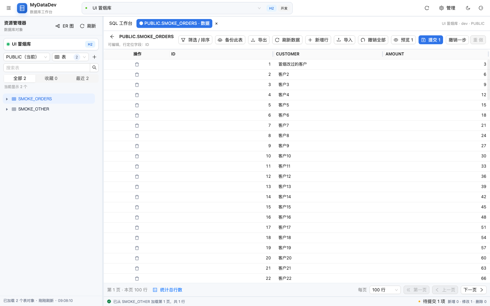
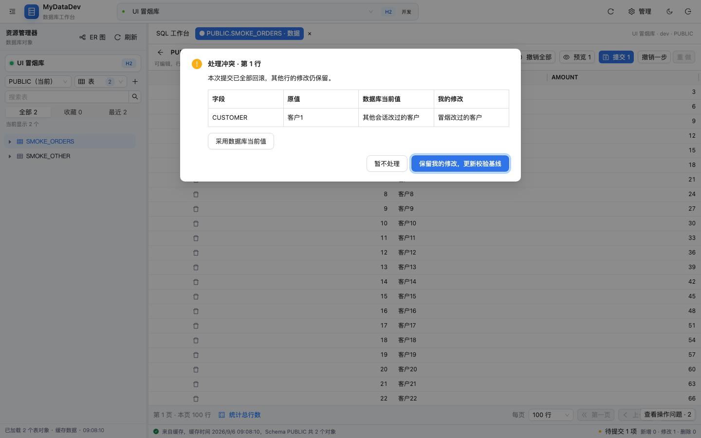
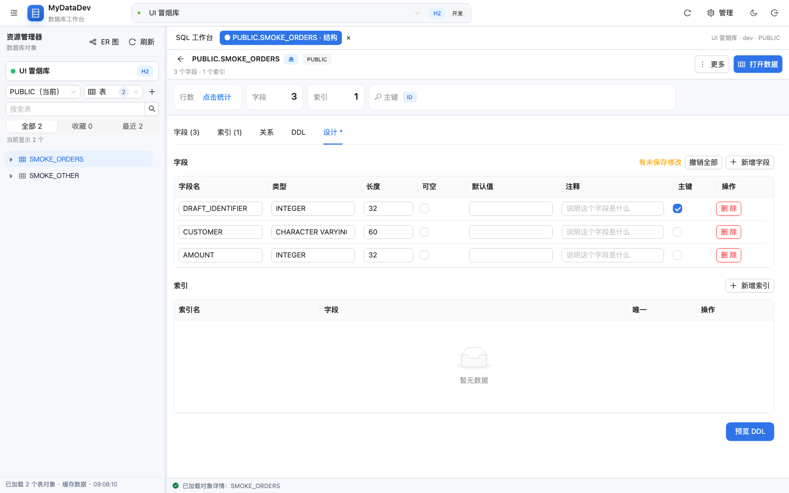

# 工作台功能打磨与验收

本轮围绕工作连续性、错误反馈、后台导出、表格编辑、连接配置、多对象标签与回归验证完成改进，沿用 Ant Design 和现有后端权限、生产确认、审计与 JDBC 导出管线。

## 用户可见变化

| 方向 | 本轮行为 |
| --- | --- |
| SQL 草稿与登录恢复 | SQL 草稿按账号与连接保存到本机，刷新后恢复；可找回最近关闭的 10 个 SQL 标签。工作台显示保存状态，存储空间不足会提示另存文件。登录过期时遮住工作台，同账号在页面内重新登录后继续编辑。 |
| 错误反馈 | 操作问题集中保留，可查看处理建议和复制含请求编号的诊断信息。写请求失去响应时显示“结果待确认”，提示先核对数据，不自动重放。界面渲染异常提供重新载入入口。 |
| 后台导出 | 手动与定时导出都进入有界后台队列，支持状态、取消、历史和下载。与其他后台任务共用每连接并发限制；重复启动同一任务会被拦截。 |
| 表格编辑 | 支持最多 50 步撤销/重做、提交前类型校验、长文本与 JSON 展开编辑。并发更新失败后整批回滚，展示原值、数据库当前值与我的修改，处理后由用户重新提交。 |
| 连接配置 | 常用数据库支持主机、端口、库名输入，同时保留高级 JDBC 和原连接参数。连接测试反馈 SSH、数据库连接与身份验证的实际阶段及耗时。 |
| 多对象工作区 | 最多打开 20 个表/对象标签，切换保留表数据的修改、分页、已应用的筛选排序、滚动位置和编辑历史；对象结构标签保持设计稿与当前分区。关闭含修改的标签时确认。 |
| 验证 | 扩展后端生命周期与错误路径测试、前端状态逻辑测试、发行包浏览器操作回归，并在 CI 增加 MySQL 8.4 / PostgreSQL 16 独立服务验证。 |

SQL 草稿只持久化文本、标题与活动标签，不持久化查询结果。表数据与结构设计草稿保留在当前页面内存中，刷新、关闭页面或跨页面单点登录会丢失未提交修改；页面离开前会提示。不同账号重新登录会切换到各自的工作区。

## 导出文件与升级

启动时 Flyway 自动执行 V19，新增 `scheduled_query_run` 运行记录表及索引，无需改目标业务库结构。

新文件写入 `app.scheduled-query.directory/task-{任务 ID}/`。文件名包含运行 UUID，中文任务名按 UTF-8 字节限制长度；同名任务和改名后的任务不会相互清理文件。输出先写 `.part`，完成后改名发布，下载只允许当前任务目录中的完整普通文件。

服务重启时，未完成且未发布的记录标记为 `INTERRUPTED` 并清理临时文件；已发布但尚未写入完成状态的文件恢复为成功。取消不会发布半成品。审计写入失败不会把已经完成的导出改成失败。

保留策略仍由 `app.scheduled-query.keep-files` 控制，默认每任务 30 个文件。过期运行保留历史但不再提供下载。删除任务会删除其运行记录和本任务目录内的产物，界面会明确提示；升级前位于共享导出根目录的旧文件保持原位，不自动归属或清理。

## 验证方式

```bash
cd backend
mvn -o clean test-compile
mvn test

cd ../frontend
npm test
npm run build

cd ../desktop
npm test
npm run build:main

cd ..
node scripts/build-web-bundle.mjs
node scripts/ui-smoke.mjs --serve --auth --work /tmp/mydatadev-ui-check --shots /tmp/mydatadev-ui-shots
```

构建与后端测试需顺序执行：Web 打包会清理 Maven 的 `target`，不能与后端测试同时运行。

浏览器回归使用系统 Chrome 与独立临时浏览器配置，不安装新测试框架。Linux 下通过 `CHROME_PATH` 指定 Chrome 路径。`--auth` 在独立实例中初始化测试管理员，通过真实登录表单进入工作区；清除浏览器会话后验证重新登录保留修改。脚本还检查跨表编辑、撤销/重做、并发冲突处理、实际落库结果、SQL 刷新恢复与关闭找回、对象设计稿保留、后台导出历史与文件内容。

MySQL/PostgreSQL 的 `DatabaseCompatibilityTest` 使用独立测试库，通过 `TEST_MYSQL_URL/USER/PASSWORD` 和 `TEST_POSTGRES_URL/USER/PASSWORD` 配置。测试创建随机名称的表并在结束时删除，覆盖真实元数据、签名游标分页、冲突读取、重新提交与 CSV 导出。未配置测试库时，本地这两项明确跳过；CI 中为它们提供独立数据库服务。

本轮本地后端共执行 869 项测试：866 项通过、3 项跳过（其中 2 项是未配置本地数据库服务的兼容性测试）。前端 666 项、桌面端 17 项通过，生产构建与原有体积预算通过。CI 的真实数据库任务需在推送后运行，本地结果不代表该任务已执行。

## 验收截图






