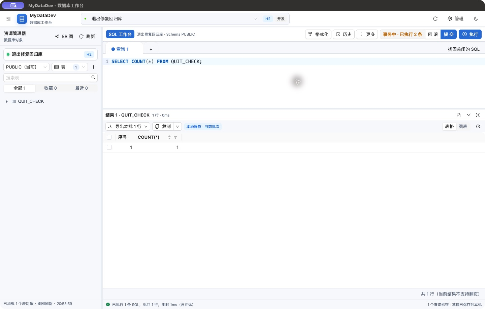

# 测试报告问题修复记录

基线：9d7299b。每个缺陷单独提交；原测试报告保留历史结果。下列验证指本次修复后的回归，不代表所有数据库和平台的重新验收。

| 缺陷 | 修复与验证 |
| --- | --- |
| REST-001 | 恢复任务和上传仅请求 id 生成键，避免 H2 同时返回 created_at 导致插入后报错；真实 H2 持久化回归、全量后端测试、前端构建通过。 |
| STORAGE-001 | 存储配置仅请求 id 生成键；真实 H2 创建、读取和更新回归。 |
| DESKSEC-001 | 保留 ResponseStatusException 的状态和响应头，错误桌面令牌返回 403；针对性错误分类回归。 |
| HTTP-001 | 请求解析、参数、内容类型和方法错误分别返回 400/415/405，并保留 Allow；真实 MVC 分发边界回归。 |
| DIFF-001 | 结构/数据对比从响应携带目标连接及 Schema；切换成功才创建目标会话标签，保留目标 Schema。会话持久化回归和前端测试。 |
| CONN-001 | 排队/执行中的 SQL 文件任务阻止修改、删除及关闭目标连接池；启动检查与入队共享连接生命周期锁，消除检查后修改窗口；权限及目标保护回归。 |
| OIDC-001 | 身份键使用完整 issuer 与 sub 的 SHA-256 组合，校验已验证 issuer 与配置一致；不同 issuer 及旧会话隔离。旧 sub-only 账号不自动继承权限，管理员需审核重新分配连接权限；无数据库 schema 变更。真实 H2 双 issuer/旧账号隔离回归。 |
| REST-002 | 提交异常显示 FAILED/UNKNOWN 和禁止盲目重试提示，独立审计未知提交；运行中取消等待最终数据库结果，确认提交后不误报取消。真实 H2 已提交但确认丢失故障回归。 |
| AUDIT-001 | 默认不接受任意代理头，显式配置受信任代理 IP/CIDR；保留 TCP 对端与原始 XFF，按链尾选择可信客户端，拒绝外置转发策略绕过；伪造地址与合法 HTTPS 代理回归。部署需配置 APP_TRUSTED_PROXIES。 |
| CORS-001 | 为凭证跨域请求暴露截断、行数上限、下载名称、请求编号及审计导出头；统一审计导出响应避免覆盖，真实 CORS MVC 回归。 |
| CH-001 | 只读查询范围根据 JDBC 事务能力跳过 ClickHouse 不支持的事务调用，保留入口 SQL 校验；不支持事务驱动与原事务保护回归。 |
| MCP-002 | 对 GO 批次中后续无分号 UPDATE/DELETE 进行词法检查，不能借前面 SELECT/WHERE 绕过确认；含歧义的多语句写入要求显式确认，忽略字符串/注释/引用标识符；MCP 整批拒绝回归。 |
| SQLFILE-001 | SQL Server 的普通 GO 批次按 plain 分析，过程/函数/触发器定义保留为一个完整执行单元；不会要求 Oracle 斜线，也不会拆开过程体；含内部分号的完整过程分析回归。 |
| SQLFILE-002 | JDBC 取消异常结合任务取消标记归为 CANCELLED，避免失败审计和后续执行；真实 H2 事务与模拟 SQL Server 取消异常回归。 |
| IO-001 | H2 UPSERT 使用原生 MERGE INTO … KEY … VALUES，保留其他方言生成方式；真实默认 H2 和 PostgreSQL 模式 CSV 生成脚本回放，验证更新旧行并插入新行。 |
| BAKSQL-001 | H2 从主键约束元数据识别内部索引，避免重复建主键索引，保留普通/唯一索引；原备份文件原样回放到空 H2，验证中文数据、复合主键、唯一约束、外键和后续自增插入。 |
| MCP-001 | 读取单元格时保留文本/CLOB 的截断信息及原因，经过来源补全和 MCP 清洗仍返回 text_limit；单行长文本及 CLOB 实库回归。SqlResult 增加兼容的 truncationReason 字段。 |
| POOL-001 | 满池获取超时使用明确的 TARGET_POOL_EXHAUSTED/503、Retry-After 和 retryable，保留 SQLState 的真实空值；实际 2 连接 H2 池耗尽与释放后恢复回归。 |
| NFS-001 | 测试/上传复用已有目录，不重复调用非幂等 mkdirs；接受并发创建目录，仍拒绝普通文件和权限失败；已有目录/竞争/失败回归。 |
| SQLFILE-003 | 仅根据实际 Servlet 输出写入帧/断连类型判断客户端断开，不再误认通用 SocketProcessor；脚本超限返回明确 413，坏 XLSX ZIP 返回输入错误，磁盘读写错误返回 500；资源清理与错误分类回归。 |
| SNAP-001 | 通过固定数量分段锁串行化同一连接/Schema 的读取、最新快照比较与插入；不会积累无界锁对象；真实 H2 元数据库 8 路手动/定时并发回归只新增一份。 |
| SNAP-002 | 漂移条目按历史→当前表达新增/删除，保留 source=之前、target=之后，不改变结构同步方向；实时与两份持久化快照的字段/索引及类型变化回归。 |
| AI-001 | 排队取消立即发送 cancelled/结束 SSE、释放会话忙状态并移除队列任务和用户名额；与工作线程开始原子协调，运行中的请求保留中断路径；取消所有权、未启动、重复取消及名额恢复回归。 |
| ER-001 | 刷新触发真实请求并明确绕过元数据缓存；错误/空图也可重试，旧请求响应继续被丢弃；真实 H2 外部新增表和外键后刷新回归。 |
| DESKQUIT-001 | 先关闭页面并处理未保存工作/事务确认，再停后端；继续使用时后端保持运行且可再次退出。区分窗口关闭阶段与最终退出，重复退出不会绕过确认；确认、取消、再次退出及关闭/停服顺序回归。 |
| UI-001 | 窄屏管理导航禁止分组压缩和文字换行，导航行按内容高度布局，超宽内容横向滚动；浏览器冒烟增加 640/860px 两种主题的文字完整、无重叠及滚动断言。 |
| UXCONTRAST-001 | 加深浅色主按钮背景，显式设置浅深色辅助文本并提高深色注释亮度；浏览器冒烟合成真实透明背景测量执行按钮、连接/Schema、无结果提示及活动行注释，要求普通文字至少 4.5:1。 |
| UXFOCUS-001 | 懒加载前保存实际焦点，取消关闭后恢复仍在页面内的原控件；执行命令保留目标焦点，快速重新打开取消旧的焦点恢复。浏览器复测编辑器、表格单元格、工具栏、首次打开及浅深色主题。 |

本轮报告中的 28 项缺陷已分别修复并形成 28 个中文提交，分支为 `codex/fix-reported-defects`。每次产品提交前均通过全量后端测试和前端构建；前端及桌面改动另外执行相关测试。

最终验证：后端 203 套测试中 1100 项通过、136 项因可选兼容环境未启用而跳过，失败/错误为 0；前端 836 项、桌面 21 项通过，前端生产构建、桌面主进程构建和 Web 打包成功。真实 Chrome 登录与工作台回归 121 项通过；68 个 JSON 请求体入口的格式/媒体类型检查共 136 次，另加账号及健康检查，总计 138 项通过。

真实 HTTP 与 H2 持久化的备份、原备份文件恢复、上传恢复、存储配置创建/列表均通过；真实 ClickHouse 的 CSV、JSON、SQL、XLSX 查询导出通过，合计 12 项。Mac 原生退出确认复测通过：继续使用后服务和原事务仍可查询，确认退出后原窗口与后端退出，独立 JDBC 读取未提交行数为 0。

浅色执行文字对比度 5.19:1、辅助文字 5.90:1、活动行注释 4.59:1；深色分别为 6.40:1、8.35:1 以上、5.78:1。640/860px 两种主题的管理导航文字完整、无重叠、可滚动；首次懒加载、表格单元格、工具栏及浅深色编辑器的焦点恢复均通过。

证据：[汇总](evidence/2026-10-04/validation.json)、[逐入口结果](evidence/2026-10-04/api-request-boundaries.json)、[浏览器记录](evidence/2026-10-04/ui-smoke.log)、[实库流程](evidence/2026-10-04/native-workflow.json)、[桌面退出](evidence/2026-10-04/desktop-quit.json)。

本次覆盖缺陷修复及上述回归，未重跑所有原生数据库/平台组合和 8 小时长稳测试；Mac 使用隔离开发主进程与新构建 JAR 的 desktop profile，不等同于新 DMG 的安装验收。原测试报告保留基线事实；修复过程中的首次颜色验证和桌面关闭清理异常均已纠正并独立重测。临时输入配置有误的测试脚本尝试不计产品结论。仍保留少量标签配色的布局待办，不代表全站无障碍认证。

按要求回收本轮测试环境：删除 26 个测试容器、14 个独立数据卷、11 个无其他容器引用的测试环境镜像、1 个专用网络、3 个测试应用及临时工作目录、数据库、备份、凭据和测试日志，本地文件占用约 15.33 GiB。报告目录中的 19 个 SQL/CSV/XLSX 测试数据文件也已删除，历史报告中指向这些文件的链接仅作为当时的证据索引；报告文字、截图与修复验证记录保留。

清理后核对上述容器、卷、镜像、网络和路径均无残留，原有 7 个服务继续运行，3 份原有数据库文件的大小及修改时间未变，9 月已有的开发目录和网络保留。[资源回收明细及验证结果](evidence/2026-10-04/cleanup.json)。28 个缺陷仍分别对应独立提交，清理记录另作一个文档提交。
